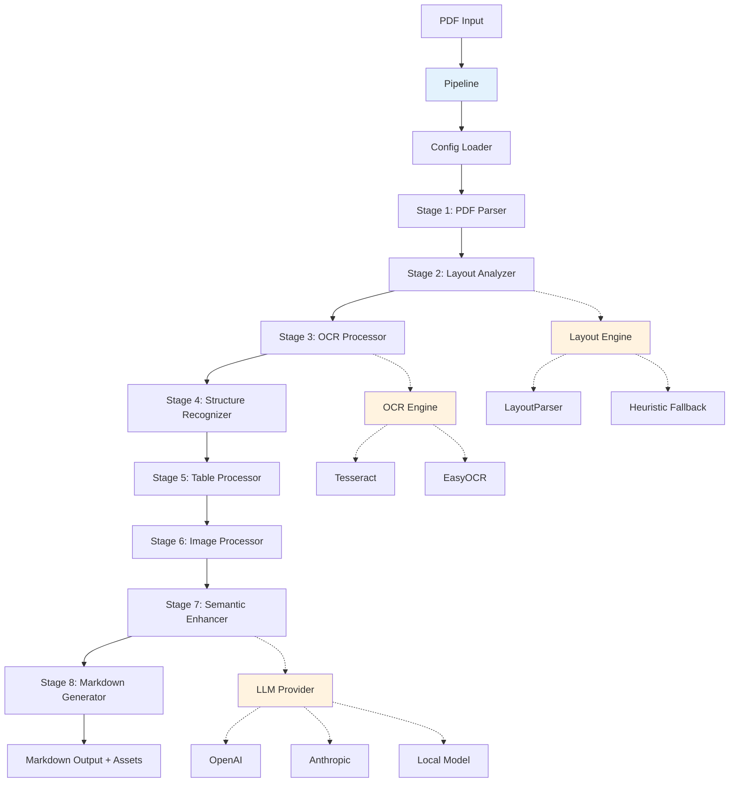
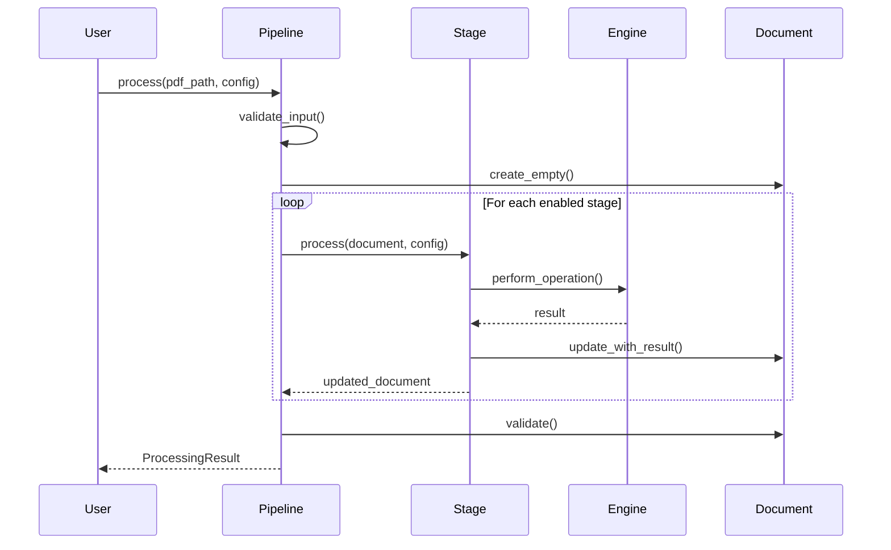

# Design Document: Core PDF Processing Pipeline

## Overview

The Core PDF Processing Pipeline is the central processing engine that orchestrates the conversion of PDF documents into structured Markdown format. It implements a multi-stage pipeline architecture where each stage performs a specific transformation on the document, passing results to the next stage. The pipeline is designed to be modular, extensible, and configurable, supporting multiple processing modes (fast, balanced, high-fidelity) and deployment scenarios (desktop, CLI, cloud API).

The design follows a clear separation of concerns: the pipeline orchestrates processing flow, stages perform specific transformations, engines provide pluggable implementations (OCR, layout detection, LLM), and data models ensure type safety and validation throughout the process.

## Steering Document Alignment

### Technical Standards (tech.md)

The design adheres to the technical decisions documented in tech.md:

- **Python as Primary Language**: All components implemented in Python 3.10+
- **PDF Processing**: Uses PyMuPDF (fitz) as primary library for PDF parsing
- **OCR Engines**: Implements Tesseract (primary) and EasyOCR (fallback) with pluggable architecture
- **Layout Analysis**: Uses LayoutParser with Detectron2 for element detection
- **Table Extraction**: Combines pdfplumber for simple tables and table-transformer for complex structures
- **LLM Integration**: Provider-agnostic design supporting OpenAI, Anthropic, and local models
- **Data Models**: Uses Pydantic for type validation and serialization
- **Configuration**: YAML-based configuration with hierarchy (defaults → files → env → CLI)
- **Pipeline Pattern**: Implements the 8-stage processing pipeline defined in tech.md
- **Plugin Architecture**: Extensible engine system for OCR, layout, and LLM providers

### Project Structure (structure.md)

The implementation follows the modular structure defined in structure.md:

**Core Package** (`smart_pdf_scanner/core/`):
- `pipeline.py`: Main pipeline orchestration
- `document.py`: Document lifecycle management
- `config.py`: Configuration loading and validation

**Processing Stages** (`smart_pdf_scanner/stages/`):
- Each stage is a separate module implementing the `ProcessingStage` interface
- Stages: `pdf_parser.py`, `layout_analyzer.py`, `ocr_processor.py`, `structure_recognizer.py`, `table_processor.py`, `image_processor.py`, `semantic_enhancer.py`, `markdown_generator.py`

**Engines** (`smart_pdf_scanner/engines/`):
- Pluggable implementations organized by type: `ocr/`, `layout/`, `llm/`
- Each engine type has a base interface and concrete implementations

**Data Models** (`smart_pdf_scanner/models/`):
- Pydantic models for type safety: `document.py`, `page.py`, `elements.py`, `structure.py`, `metadata.py`

**Utilities** (`smart_pdf_scanner/utils/`):
- Shared helpers: `bbox.py`, `image_utils.py`, `text_utils.py`, `cache.py`, `logging.py`

**Visualization** (`smart_pdf_scanner/visualization/`):
- Bounding box rendering: `renderer.py`, `colors.py`, `export.py`

## Code Reuse Analysis

### Existing Components to Leverage

Since this is a new project, we're building the foundation. However, we'll leverage:

- **External Libraries**: PyMuPDF, pdfplumber, pytesseract, layoutparser, Pillow, Pydantic (as per tech.md)
- **Standard Patterns**: Python's ABC for interfaces, dataclasses/Pydantic for models, logging module for structured logging
- **Design Patterns**: Strategy pattern (engines), Pipeline pattern (stages), Factory pattern (engine creation)

### Integration Points

- **Desktop Application**: Will import and use the core pipeline from `smart_pdf_scanner.core.pipeline`
- **CLI Tool**: Will import pipeline and provide command-line interface
- **Cloud API**: Will import pipeline and wrap in FastAPI endpoints
- **Configuration System**: All interfaces will use the same configuration schema
- **Logging System**: All components will use centralized logging configuration

## Architecture

The architecture implements a **Pipeline Pattern** with **Strategy Pattern** for pluggable engines. Each processing stage is independent and testable, with clear input/output contracts.

### Modular Design Principles

- **Single File Responsibility**: Each stage handles one transformation (e.g., `pdf_parser.py` only extracts raw data)
- **Component Isolation**: Stages don't directly depend on each other, only on the Document model
- **Service Layer Separation**: Engines (OCR, layout, LLM) are abstracted behind interfaces
- **Utility Modularity**: Shared utilities (bbox operations, image processing) are in separate focused modules

### Architecture Diagram



### Data Flow



## Components and Interfaces

### Component 1: Pipeline

**File**: `smart_pdf_scanner/core/pipeline.py`

**Purpose**: Orchestrates the execution of processing stages in sequence, manages document state, handles errors, and emits progress events.

**Interfaces**:
```python
class Pipeline:
    def __init__(self, stages: List[ProcessingStage], config: Config):
        """Initialize pipeline with stages and configuration"""
        
    def process(self, pdf_path: Path, config: Optional[Config] = None) -> ProcessingResult:
        """Process a PDF file through all stages"""
        
    def validate_input(self, pdf_path: Path) -> None:
        """Validate PDF file exists, is valid, and within size limits"""
        
    def emit_progress(self, stage_name: str, page: int, total_pages: int) -> None:
        """Emit progress event for UI integration"""
```

**Dependencies**: 
- `ProcessingStage` interface
- `Document` model
- `Config` model
- `ProcessingResult` model
- Logging utilities

**Reuses**: Python's logging module, pathlib for file handling

### Component 2: ProcessingStage (Base Interface)

**File**: `smart_pdf_scanner/stages/base.py`

**Purpose**: Defines the contract that all processing stages must implement, ensuring consistent interface and behavior.

**Interfaces**:
```python
from abc import ABC, abstractmethod

class ProcessingStage(ABC):
    @abstractmethod
    def process(self, document: Document, config: Config) -> Document:
        """Process document and return updated version"""
        pass
    
    @abstractmethod
    def validate(self, document: Document) -> List[ValidationWarning]:
        """Validate stage output and return warnings"""
        pass
    
    @property
    @abstractmethod
    def name(self) -> str:
        """Return stage name for logging"""
        pass
```

**Dependencies**: 
- `Document` model
- `Config` model
- `ValidationWarning` model

**Reuses**: Python's ABC module

### Component 3: PDFParser Stage

**File**: `smart_pdf_scanner/stages/pdf_parser.py`

**Purpose**: Extracts raw text, images, and metadata from PDF using PyMuPDF.

**Interfaces**:
```python
class PDFParser(ProcessingStage):
    def process(self, document: Document, config: Config) -> Document:
        """Extract text, images, metadata from PDF"""
        
    def extract_text_with_positions(self, page: fitz.Page) -> List[TextElement]:
        """Extract text with bounding box coordinates"""
        
    def extract_images(self, page: fitz.Page, page_num: int) -> List[Image]:
        """Extract embedded images and save to assets folder"""
        
    def extract_metadata(self, pdf: fitz.Document) -> DocumentMetadata:
        """Extract PDF metadata (title, author, etc.)"""
```

**Dependencies**: 
- PyMuPDF (fitz)
- `Document`, `Page`, `TextElement`, `Image` models
- Image utilities for saving

**Reuses**: Pillow for image format conversion

### Component 4: LayoutAnalyzer Stage

**File**: `smart_pdf_scanner/stages/layout_analyzer.py`

**Purpose**: Detects and classifies layout elements (text blocks, headings, tables, figures) using layout detection models.

**Interfaces**:
```python
class LayoutAnalyzer(ProcessingStage):
    def __init__(self, layout_engine: LayoutEngine):
        """Initialize with pluggable layout engine"""
        
    def process(self, document: Document, config: Config) -> Document:
        """Analyze layout and classify elements"""
        
    def detect_elements(self, page: Page) -> List[Element]:
        """Detect layout elements on a page"""
        
    def classify_element(self, element: Element, context: PageContext) -> ElementType:
        """Classify element type based on features"""
        
    def detect_columns(self, page: Page) -> List[ColumnBoundary]:
        """Detect multi-column layouts"""
```

**Dependencies**: 
- `LayoutEngine` interface
- `Document`, `Page`, `Element` models
- Bounding box utilities

**Reuses**: LayoutParser library, bbox utilities

### Component 5: OCRProcessor Stage

**File**: `smart_pdf_scanner/stages/ocr_processor.py`

**Purpose**: Performs OCR on image-based pages and text within images using configurable OCR engines.

**Interfaces**:
```python
class OCRProcessor(ProcessingStage):
    def __init__(self, primary_engine: OCREngine, fallback_engine: Optional[OCREngine] = None):
        """Initialize with primary and optional fallback OCR engines"""
        
    def process(self, document: Document, config: Config) -> Document:
        """Perform OCR on image-based content"""
        
    def ocr_page(self, page: Page) -> OCRResult:
        """OCR entire page if it's image-based"""
        
    def ocr_image(self, image: Image) -> str:
        """Extract text from an image element"""
        
    def preprocess_image(self, image: Image) -> Image:
        """Apply preprocessing (deskew, denoise, contrast)"""
```

**Dependencies**: 
- `OCREngine` interface
- `Document`, `Page`, `Image` models
- Image preprocessing utilities

**Reuses**: OpenCV for preprocessing, pytesseract/EasyOCR engines

### Component 6: StructureRecognizer Stage

**File**: `smart_pdf_scanner/stages/structure_recognizer.py`

**Purpose**: Reconstructs logical document structure including heading hierarchy, reading order, and table of contents linking.

**Interfaces**:
```python
class StructureRecognizer(ProcessingStage):
    def process(self, document: Document, config: Config) -> Document:
        """Recognize document structure"""
        
    def identify_headings(self, elements: List[Element]) -> List[Heading]:
        """Identify headings based on font size, weight, position"""
        
    def build_hierarchy(self, headings: List[Heading]) -> HeadingHierarchy:
        """Build heading hierarchy (H1-H6 levels)"""
        
    def determine_reading_order(self, elements: List[Element]) -> List[int]:
        """Determine reading order using spatial analysis"""
        
    def link_toc(self, toc: TableOfContents, headings: List[Heading]) -> TOCLinks:
        """Link TOC entries to document sections"""
```

**Dependencies**: 
- `Document`, `Element`, `Heading`, `TableOfContents` models
- Text utilities for matching

**Reuses**: Text similarity algorithms, spatial analysis utilities

### Component 7: TableProcessor Stage

**File**: `smart_pdf_scanner/stages/table_processor.py`

**Purpose**: Extracts and converts tables to Markdown format, handling simple and complex table structures.

**Interfaces**:
```python
class TableProcessor(ProcessingStage):
    def process(self, document: Document, config: Config) -> Document:
        """Process all table elements"""
        
    def extract_table(self, table_element: Element, page: Page) -> Table:
        """Extract table structure and content"""
        
    def convert_to_markdown(self, table: Table) -> str:
        """Convert table to Markdown format"""
        
    def export_to_csv(self, table: Table, output_path: Path) -> None:
        """Export table to CSV file (optional)"""
```

**Dependencies**: 
- pdfplumber, table-transformer
- `Document`, `Table` models

**Reuses**: pdfplumber for simple tables, ML model for complex tables

### Component 8: ImageProcessor Stage

**File**: `smart_pdf_scanner/stages/image_processor.py`

**Purpose**: Classifies images, extracts text within images, and generates descriptions.

**Interfaces**:
```python
class ImageProcessor(ProcessingStage):
    def __init__(self, llm_provider: Optional[LLMProvider] = None):
        """Initialize with optional LLM for descriptions"""
        
    def process(self, document: Document, config: Config) -> Document:
        """Process all image elements"""
        
    def classify_image(self, image: Image) -> ImageType:
        """Classify image as photo, diagram, chart, etc."""
        
    def extract_text_from_image(self, image: Image) -> str:
        """OCR text within image"""
        
    def generate_description(self, image: Image, context: str) -> str:
        """Generate textual description (LLM or basic)"""
```

**Dependencies**: 
- `LLMProvider` interface (optional)
- `OCREngine` for text extraction
- `Document`, `Image` models

**Reuses**: OCR engine, LLM provider, image classification utilities

### Component 9: SemanticEnhancer Stage

**File**: `smart_pdf_scanner/stages/semantic_enhancer.py`

**Purpose**: Uses LLM reasoning to refine ambiguous structures and enhance descriptions (optional, high-fidelity mode).

**Interfaces**:
```python
class SemanticEnhancer(ProcessingStage):
    def __init__(self, llm_provider: LLMProvider):
        """Initialize with LLM provider"""
        
    def process(self, document: Document, config: Config) -> Document:
        """Enhance document with LLM reasoning"""
        
    def refine_hierarchy(self, headings: List[Heading]) -> List[Heading]:
        """Refine ambiguous heading hierarchy"""
        
    def enhance_descriptions(self, images: List[Image]) -> List[Image]:
        """Enhance image descriptions with context"""
        
    def resolve_ambiguities(self, elements: List[Element]) -> List[Element]:
        """Resolve structural ambiguities"""
```

**Dependencies**: 
- `LLMProvider` interface
- `Document`, `Heading`, `Image`, `Element` models

**Reuses**: LLM provider, caching utilities

### Component 10: MarkdownGenerator Stage

**File**: `smart_pdf_scanner/stages/markdown_generator.py`

**Purpose**: Generates final Markdown output from processed document structure.

**Interfaces**:
```python
class MarkdownGenerator(ProcessingStage):
    def process(self, document: Document, config: Config) -> Document:
        """Generate Markdown output"""
        
    def assemble_markdown(self, document: Document) -> str:
        """Assemble elements in reading order"""
        
    def format_heading(self, heading: Heading) -> str:
        """Format heading as Markdown (# to ######)"""
        
    def format_table(self, table: Table) -> str:
        """Format table as Markdown table"""
        
    def format_image(self, image: Image) -> str:
        """Format image as Markdown link with alt text"""
        
    def write_output(self, markdown: str, output_path: Path) -> None:
        """Write Markdown to file"""
```

**Dependencies**: 
- `Document`, `Heading`, `Table`, `Image` models
- File I/O utilities

**Reuses**: Python's pathlib, string formatting

### Component 11: OCREngine Interface

**File**: `smart_pdf_scanner/engines/ocr/base.py`

**Purpose**: Defines the contract for OCR engine implementations.

**Interfaces**:
```python
from abc import ABC, abstractmethod

class OCREngine(ABC):
    @abstractmethod
    def extract_text(self, image: Image, config: OCRConfig) -> OCRResult:
        """Extract text from image"""
        pass
    
    @abstractmethod
    def get_confidence(self, result: OCRResult) -> float:
        """Get confidence score for OCR result"""
        pass
    
    @property
    @abstractmethod
    def name(self) -> str:
        """Return engine name"""
        pass
```

**Implementations**:
- `TesseractEngine` (`tesseract.py`)
- `EasyOCREngine` (`easyocr.py`)
- `CloudOCREngine` (`cloud_ocr.py`) - optional

### Component 12: LayoutEngine Interface

**File**: `smart_pdf_scanner/engines/layout/base.py`

**Purpose**: Defines the contract for layout detection engine implementations.

**Interfaces**:
```python
from abc import ABC, abstractmethod

class LayoutEngine(ABC):
    @abstractmethod
    def detect_layout(self, page: Page, config: LayoutConfig) -> List[Element]:
        """Detect layout elements on a page"""
        pass
    
    @abstractmethod
    def get_confidence(self, element: Element) -> float:
        """Get confidence score for detected element"""
        pass
    
    @property
    @abstractmethod
    def name(self) -> str:
        """Return engine name"""
        pass
```

**Implementations**:
- `LayoutParserEngine` (`layoutparser.py`)
- `DocTREngine` (`doctr.py`)
- `HeuristicEngine` (`heuristic.py`) - fallback

### Component 13: LLMProvider Interface

**File**: `smart_pdf_scanner/engines/llm/base.py`

**Purpose**: Defines the contract for LLM provider implementations.

**Interfaces**:
```python
from abc import ABC, abstractmethod

class LLMProvider(ABC):
    @abstractmethod
    def generate_text(self, prompt: str, config: LLMConfig) -> str:
        """Generate text from prompt"""
        pass
    
    @abstractmethod
    def generate_with_vision(self, prompt: str, image: Image, config: LLMConfig) -> str:
        """Generate text from prompt and image (vision models)"""
        pass
    
    @abstractmethod
    def estimate_tokens(self, text: str) -> int:
        """Estimate token count for cost calculation"""
        pass
    
    @property
    @abstractmethod
    def name(self) -> str:
        """Return provider name"""
        pass
```

**Implementations**:
- `OpenAIProvider` (`openai.py`)
- `AnthropicProvider` (`anthropic.py`)
- `LocalModelProvider` (`local.py`)

### Component 14: Configuration Manager

**File**: `smart_pdf_scanner/core/config.py`

**Purpose**: Loads and validates configuration from multiple sources with proper hierarchy.

**Interfaces**:
```python
class ConfigManager:
    @staticmethod
    def load(config_path: Optional[Path] = None, overrides: Optional[Dict] = None) -> Config:
        """Load configuration with hierarchy: defaults → file → env → overrides"""
        
    @staticmethod
    def validate(config: Config) -> List[ValidationError]:
        """Validate configuration and return errors"""
        
    @staticmethod
    def get_preset(mode: ProcessingMode) -> Config:
        """Get preset configuration for processing mode (fast/balanced/high-fidelity)"""
```

**Dependencies**: 
- PyYAML for YAML parsing
- Pydantic for validation
- `Config` model

**Reuses**: Python's os.environ, pathlib

## Data Models

All data models use Pydantic for validation and serialization.

### Document Model

**File**: `smart_pdf_scanner/models/document.py`

```python
from pydantic import BaseModel, Field
from typing import List, Optional
from pathlib import Path

class Document(BaseModel):
    """Top-level document container"""
    
    metadata: DocumentMetadata
    pages: List[Page] = Field(default_factory=list)
    structure: Optional[DocumentStructure] = None
    assets_folder: Path
    processing_warnings: List[str] = Field(default_factory=list)
    
    def add_page(self, page: Page) -> None:
        """Add a page to the document"""
        
    def get_page(self, page_num: int) -> Optional[Page]:
        """Get page by number"""
        
    def get_all_elements(self) -> List[Element]:
        """Get all elements across all pages"""
```

### Page Model

**File**: `smart_pdf_scanner/models/page.py`

```python
from pydantic import BaseModel, Field
from typing import List

class Page(BaseModel):
    """Individual page with elements"""
    
    page_number: int
    elements: List[Element] = Field(default_factory=list)
    dimensions: PageDimensions
    is_image_based: bool = False
    ocr_confidence: Optional[float] = None
    
    def add_element(self, element: Element) -> None:
        """Add an element to the page"""
        
    def get_elements_by_type(self, element_type: ElementType) -> List[Element]:
        """Get elements of specific type"""

class PageDimensions(BaseModel):
    """Page dimensions in points"""
    width: float
    height: float
```

### Element Models

**File**: `smart_pdf_scanner/models/elements.py`

```python
from pydantic import BaseModel
from typing import Optional
from enum import Enum

class ElementType(str, Enum):
    TEXT_BLOCK = "text_block"
    HEADING = "heading"
    TABLE = "table"
    IMAGE = "image"
    CAPTION = "caption"
    FOOTNOTE = "footnote"
    SIDEBAR = "sidebar"

class BoundingBox(BaseModel):
    """Bounding box coordinates"""
    x0: float
    y0: float
    x1: float
    y1: float
    
    def area(self) -> float:
        """Calculate bounding box area"""
        return (self.x1 - self.x0) * (self.y1 - self.y0)
    
    def intersects(self, other: 'BoundingBox') -> bool:
        """Check if this bbox intersects with another"""

class Element(BaseModel):
    """Base element class"""
    element_id: str
    element_type: ElementType
    bbox: BoundingBox
    page_number: int
    confidence: float = 1.0

class TextBlock(Element):
    """Text block element"""
    text: str
    font_info: Optional[FontInfo] = None
    reading_order: int = 0
    hierarchy_level: Optional[int] = None

class Heading(TextBlock):
    """Heading element"""
    level: int  # 1-6 for H1-H6
    
class Table(Element):
    """Table element"""
    rows: List[TableRow]
    headers: Optional[List[str]] = None
    markdown: str
    csv_path: Optional[Path] = None

class TableRow(BaseModel):
    """Table row"""
    cells: List[str]

class Image(Element):
    """Image element"""
    image_path: Path
    image_type: ImageType
    description: str
    ocr_text: Optional[str] = None
    caption: Optional[str] = None

class ImageType(str, Enum):
    PHOTOGRAPH = "photograph"
    DIAGRAM = "diagram"
    CHART = "chart"
    GRAPH = "graph"
    ILLUSTRATION = "illustration"
    OTHER = "other"

class FontInfo(BaseModel):
    """Font information"""
    name: str
    size: float
    weight: str  # normal, bold
    style: str  # normal, italic
```

### Structure Models

**File**: `smart_pdf_scanner/models/structure.py`

```python
from pydantic import BaseModel
from typing import List, Optional

class DocumentStructure(BaseModel):
    """Document logical structure"""
    headings: List[Heading]
    toc: Optional[TableOfContents] = None
    reading_order: List[str]  # List of element_ids in reading order
    links: List[Link] = Field(default_factory=list)

class TableOfContents(BaseModel):
    """Table of contents"""
    entries: List[TOCEntry]

class TOCEntry(BaseModel):
    """TOC entry"""
    title: str
    page_number: int
    level: int
    linked_heading_id: Optional[str] = None

class Link(BaseModel):
    """Document link"""
    source_element_id: str
    target: str  # URL or internal reference
    link_type: LinkType

class LinkType(str, Enum):
    INTERNAL = "internal"
    EXTERNAL = "external"
```

### Metadata Model

**File**: `smart_pdf_scanner/models/metadata.py`

```python
from pydantic import BaseModel
from typing import Optional
from datetime import datetime

class DocumentMetadata(BaseModel):
    """PDF metadata"""
    title: Optional[str] = None
    author: Optional[str] = None
    subject: Optional[str] = None
    keywords: Optional[str] = None
    creator: Optional[str] = None
    producer: Optional[str] = None
    creation_date: Optional[datetime] = None
    modification_date: Optional[datetime] = None
    page_count: int
    file_size_bytes: int
```

### Configuration Model

**File**: `smart_pdf_scanner/models/config.py`

```python
from pydantic import BaseModel, Field
from typing import Optional, List
from enum import Enum

class ProcessingMode(str, Enum):
    FAST = "fast"
    BALANCED = "balanced"
    HIGH_FIDELITY = "high_fidelity"

class Config(BaseModel):
    """Pipeline configuration"""
    
    # General
    processing_mode: ProcessingMode = ProcessingMode.BALANCED
    max_file_size_mb: int = 150
    
    # Stages
    enabled_stages: List[str] = Field(default_factory=lambda: [
        "pdf_parser", "layout_analyzer", "ocr_processor",
        "structure_recognizer", "table_processor", "image_processor",
        "semantic_enhancer", "markdown_generator"
    ])
    
    # OCR
    ocr_engine: str = "tesseract"
    ocr_languages: List[str] = Field(default_factory=lambda: ["eng"])
    ocr_confidence_threshold: float = 0.7
    
    # Layout
    layout_engine: str = "layoutparser"
    layout_model: str = "lp://PubLayNet/faster_rcnn_R_50_FPN_3x/config"
    layout_confidence_threshold: float = 0.7
    
    # LLM
    llm_provider: Optional[str] = "openai"
    llm_model: str = "gpt-4-turbo"
    llm_max_tokens: int = 4096
    llm_temperature: float = 0.1
    
    # Output
    output_format: str = "markdown"
    include_page_numbers: bool = True
    export_tables_csv: bool = False
    
    # Performance
    parallel_pages: bool = False
    max_workers: int = 4
    cache_enabled: bool = True
    
    # Logging
    log_level: str = "INFO"
    log_format: str = "json"

class OCRConfig(BaseModel):
    """OCR-specific configuration"""
    engine: str
    languages: List[str]
    confidence_threshold: float
    preprocess: bool = True

class LayoutConfig(BaseModel):
    """Layout-specific configuration"""
    engine: str
    model: str
    confidence_threshold: float

class LLMConfig(BaseModel):
    """LLM-specific configuration"""
    provider: str
    model: str
    max_tokens: int
    temperature: float
    api_key: Optional[str] = None
```

### Processing Result Model

**File**: `smart_pdf_scanner/models/result.py`

```python
from pydantic import BaseModel
from typing import List, Optional
from pathlib import Path
from datetime import datetime

class ProcessingResult(BaseModel):
    """Result of pipeline processing"""
    
    success: bool
    document: Optional[Document] = None
    markdown_path: Optional[Path] = None
    assets_folder: Optional[Path] = None
    warnings: List[str] = Field(default_factory=list)
    errors: List[str] = Field(default_factory=list)
    statistics: ProcessingStatistics
    
class ProcessingStatistics(BaseModel):
    """Processing statistics"""
    total_pages: int
    pages_processed: int
    elements_detected: int
    tables_extracted: int
    images_extracted: int
    processing_time_seconds: float
    start_time: datetime
    end_time: datetime
```

## Error Handling

### Error Scenarios

1. **Invalid PDF File**
   - **Handling**: Validate file exists, is readable, and has valid PDF magic bytes in `Pipeline.validate_input()`
   - **User Impact**: Clear error message: "Invalid PDF file: {path}. File does not exist or is not a valid PDF."

2. **PDF Size Exceeds Limit**
   - **Handling**: Check file size in `validate_input()`, reject if > configured limit (default 150 MB)
   - **User Impact**: Error message: "PDF file too large: {size} MB. Maximum allowed: {limit} MB."

3. **OCR Engine Failure**
   - **Handling**: Catch exceptions in `OCRProcessor`, try fallback engine if configured, log warning if both fail
   - **User Impact**: Warning in output: "OCR failed for page {N}. Page may have incomplete text."

4. **Layout Detection Failure**
   - **Handling**: Catch exceptions in `LayoutAnalyzer`, fall back to heuristic layout detection
   - **User Impact**: Warning: "Layout detection failed for page {N}. Using fallback method."

5. **LLM API Failure**
   - **Handling**: Retry with exponential backoff (3 attempts), fall back to non-LLM results if all fail
   - **User Impact**: Warning: "LLM enhancement unavailable. Using deterministic results."

6. **Table Extraction Failure**
   - **Handling**: Catch exceptions in `TableProcessor`, treat table as text block, log warning
   - **User Impact**: Warning: "Table extraction failed on page {N}. Table rendered as text."

7. **Out of Memory**
   - **Handling**: Process pages sequentially if parallel processing fails, reduce batch size
   - **User Impact**: Info message: "Switching to sequential processing due to memory constraints."

8. **Corrupted PDF**
   - **Handling**: Catch PyMuPDF exceptions, attempt partial processing of valid pages
   - **User Impact**: Warning: "PDF appears corrupted. Processed {N} of {M} pages successfully."

9. **Missing Dependencies**
   - **Handling**: Check for required libraries at import time, provide clear installation instructions
   - **User Impact**: Error: "Missing dependency: {library}. Install with: pip install {library}"

10. **Configuration Errors**
    - **Handling**: Validate configuration in `ConfigManager.validate()`, reject invalid configs with specific errors
    - **User Impact**: Error: "Invalid configuration: {field} must be {constraint}."

### Error Recovery Strategy

- **Partial Processing**: Continue processing remaining pages/stages even if one fails
- **Graceful Degradation**: Fall back to simpler methods when advanced techniques fail
- **Retry Logic**: Retry transient failures (network errors) with exponential backoff
- **Detailed Logging**: Log all errors with full context for debugging
- **User Feedback**: Provide clear, actionable error messages

## Testing Strategy

### Unit Testing

**Framework**: pytest

**Approach**:
- Test each processing stage independently with mock dependencies
- Test each engine implementation with sample inputs
- Test data models for validation and serialization
- Test utilities (bbox operations, image processing) with edge cases

**Key Components to Test**:
- `Pipeline.validate_input()` - file validation logic
- `PDFParser.extract_text_with_positions()` - text extraction accuracy
- `LayoutAnalyzer.detect_elements()` - element detection with mock layout engine
- `OCRProcessor.ocr_page()` - OCR with mock engine
- `StructureRecognizer.build_hierarchy()` - heading hierarchy logic
- `TableProcessor.convert_to_markdown()` - table formatting
- `MarkdownGenerator.assemble_markdown()` - output assembly
- `BoundingBox.intersects()` - bbox geometry
- `ConfigManager.load()` - configuration loading and hierarchy

**Test Files**:
- `tests/unit/test_pipeline.py`
- `tests/unit/test_stages/test_pdf_parser.py`
- `tests/unit/test_stages/test_layout_analyzer.py`
- `tests/unit/test_engines/test_ocr_engines.py`
- `tests/unit/test_models/test_document.py`
- `tests/unit/test_utils/test_bbox.py`

### Integration Testing

**Approach**:
- Test full pipeline with sample PDFs
- Test stage interactions and data flow
- Test engine switching (OCR fallback, layout fallback)
- Test configuration modes (fast, balanced, high-fidelity)

**Key Flows to Test**:
- **Simple PDF**: Single-column text document → verify structure and output
- **Multi-column PDF**: Two-column layout → verify reading order
- **Scanned PDF**: Image-based document → verify OCR accuracy
- **Complex Tables**: PDF with merged cells → verify table extraction
- **Mixed Content**: Text + images + tables → verify all elements processed
- **Large PDF**: 100+ page document → verify memory management
- **Error Recovery**: Corrupted page in middle → verify partial processing

**Test Files**:
- `tests/integration/test_end_to_end.py`
- `tests/integration/test_pipeline_stages.py`
- `tests/integration/test_engine_fallback.py`

### End-to-End Testing

**Approach**:
- Process real-world PDF samples through complete pipeline
- Compare output against golden datasets (expected Markdown)
- Validate visualization output
- Test different configuration modes

**User Scenarios to Test**:
1. **Academic Paper Processing**: Multi-column paper with figures and tables
2. **Business Report**: Charts, graphs, and financial tables
3. **Scanned Book**: Image-based pages with complex layout
4. **Technical Manual**: Diagrams, code blocks, and nested headings
5. **Form Document**: Tables and structured data

**Validation**:
- Markdown structure matches expected output (heading hierarchy, reading order)
- All images extracted and linked correctly
- Tables converted accurately
- Page numbers preserved
- No data loss (all text present in output)

**Test Files**:
- `tests/e2e/test_academic_paper.py`
- `tests/e2e/test_business_report.py`
- `tests/e2e/test_scanned_document.py`

### Performance Testing

**Approach**:
- Benchmark processing speed for different PDF types
- Profile memory usage during processing
- Test scalability with large documents

**Metrics**:
- Processing time per page (target: 1-15 seconds depending on mode)
- Memory usage (target: < 4 GB for 150 MB PDF)
- Throughput (pages per minute)

**Test Files**:
- `tests/performance/test_benchmarks.py`

### Test Fixtures

**Location**: `tests/fixtures/`

**Sample PDFs**:
- `simple_text.pdf` - Single column, plain text
- `multi_column.pdf` - Two-column layout
- `scanned_document.pdf` - Image-based pages
- `complex_tables.pdf` - Tables with merged cells
- `mixed_content.pdf` - Text, images, tables
- `large_document.pdf` - 100+ pages

**Expected Outputs**:
- `expected/simple_text.md`
- `expected/multi_column.md`
- etc.

## Implementation Notes

### Development Phases

**Phase 1: Core Infrastructure** (Foundation)
- Implement data models (Document, Page, Element, etc.)
- Implement Pipeline orchestration
- Implement Configuration management
- Set up logging and error handling

**Phase 2: Basic Processing** (MVP)
- Implement PDFParser stage
- Implement basic LayoutAnalyzer (heuristic)
- Implement MarkdownGenerator stage
- End-to-end processing for simple PDFs

**Phase 3: Advanced Processing**
- Implement OCRProcessor with Tesseract
- Implement LayoutParser integration
- Implement StructureRecognizer
- Implement TableProcessor

**Phase 4: Intelligence Layer**
- Implement ImageProcessor
- Implement LLM integration
- Implement SemanticEnhancer
- Add fallback mechanisms

**Phase 5: Optimization & Polish**
- Add caching
- Add parallel processing
- Add visualization
- Performance tuning

### Dependencies Installation

```bash
# Core dependencies
pip install PyMuPDF>=1.23.0 pdfplumber>=0.10.0 pydantic>=2.0.0

# OCR
pip install pytesseract>=0.3.10 easyocr>=1.7.0

# Layout analysis
pip install layoutparser>=0.3.4 detectron2>=0.6

# Image processing
pip install Pillow>=10.0.0 opencv-python>=4.8.0

# LLM
pip install openai>=1.0.0 anthropic>=0.18.0

# Utilities
pip install pyyaml>=6.0 python-dotenv>=1.0.0

# Testing
pip install pytest>=7.4.0 pytest-cov>=4.1.0
```

### Configuration Presets

**Fast Mode** (`config/fast-mode.yaml`):
```yaml
processing_mode: fast
enabled_stages:
  - pdf_parser
  - layout_analyzer
  - markdown_generator
ocr_engine: tesseract
layout_engine: heuristic
llm_provider: null
```

**Balanced Mode** (`config/balanced-mode.yaml`):
```yaml
processing_mode: balanced
enabled_stages:
  - pdf_parser
  - layout_analyzer
  - ocr_processor
  - structure_recognizer
  - table_processor
  - markdown_generator
ocr_engine: tesseract
layout_engine: layoutparser
llm_provider: null
```

**High-Fidelity Mode** (`config/high-fidelity-mode.yaml`):
```yaml
processing_mode: high_fidelity
enabled_stages:
  - pdf_parser
  - layout_analyzer
  - ocr_processor
  - structure_recognizer
  - table_processor
  - image_processor
  - semantic_enhancer
  - markdown_generator
ocr_engine: tesseract
ocr_fallback: easyocr
layout_engine: layoutparser
llm_provider: openai
llm_model: gpt-4-turbo
```
